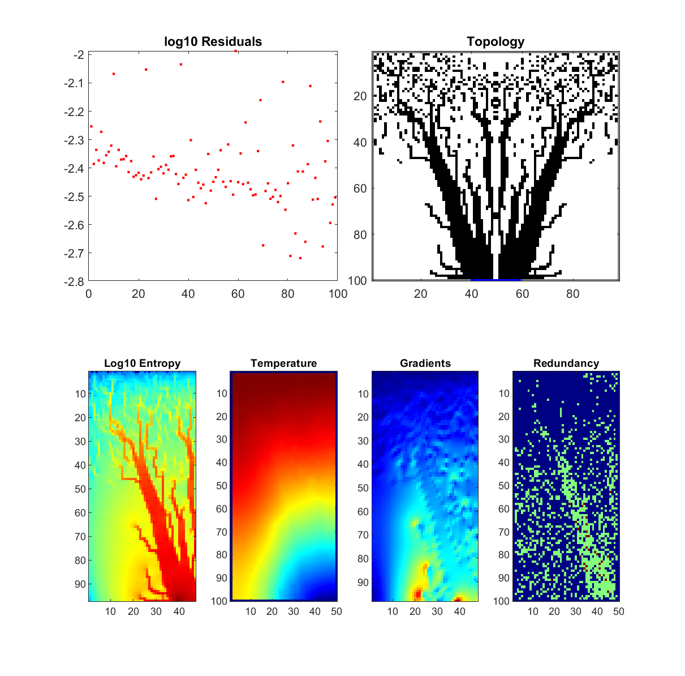
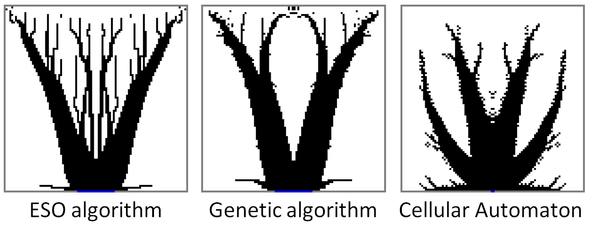

## Evolutionary Structural Optimisation (ESO) algorithm for thermal science

This code is intended to solve the Area-to-point problem in thermal science with a bidirectionnal ESO algorithm. The results of this algorithm has never been published in any peer-reviewed journal, since it's very well-known and has been implemented many times before mine (or I guess ?). 

It is very easy to use: enter the filling ratio and the ratio of conductivity of two materials on a heating surface linked to a localized heat sink and it makes the conductive matter (in dark) evolve following a very simple principle :
- find the position of the least quantity (a pixel) of conductive matter that does not impede maximal temperature of the domain when it's removed;
- find the position of the least quantity (a pixel) of conductive matter that decreases at most maximal temperature of the domain when it's added;
- exchange the two cell properties so that quantity of draining (conductive) material is constant and continue. Adding a bit of randomness at this step, like taking the best swap among 5 possibilities for example, is better. Several cells can be exchanged at this step to speed up convergence in particular at the beginning;
- the codes stops when repeated exchanges of positions are detected.
  
The shape obtained presents a very efficient (and optimal) design to cool a distributed heated surfaces like a computer chips, battery stacks, some parts of fuel cells, etc. The theoretical optimal solution to the problem must have equalized temperatures along the adiabatic borders. The code is very simple and super effective, but also quite slow to converge. Results are similar to the [Genetic Algorithm case](https://github.com/Raphael-Boichot/A-genetic-algorithm-for-topology-optimization-of-area-to-point-heat-conduction-problem).

An improvement of this code is also available: the [Progressive ESO (PESO)][(](https://github.com/Raphael-Boichot/Progressive-evolutionary-structural-optimisation-algorithm))

**Code free to use, please cite the author according to the license !**

It is meant to be used with the [Parallel computing toolbox of Matlab](https://fr.mathworks.com/products/parallel-computing.html) on multi-core processors. The code itself solves a Finite Difference approximation of the heat equation on unspecified shapes with a direct sparse solver. The test case converges in about one day on a desktop computer with 8 cores.

## Test case

## Exemple of code output during convergence

## Exemple of converged shapes with kp/k0=10, filling ratio = 0.3 and various algorithms

## Exemple of convergence with kp/k0=10 and filling ratio = 0.3 (20 steps per frame)

## Additional notes
ESO and [Genetic algorithm](https://github.com/Raphael-Boichot/A-genetic-algorithm-for-topology-optimization-of-area-to-point-heat-conduction-problem) gives very similar shapes in terms of thermal performances, with ESO being about 10 times faster than GA. [Cellular Automaton](https://github.com/Raphael-Boichot/Tree-network-structure-generation-for-heat-conduction-by-cellular-automaton), not an optimization algorithm stricto sensu, converges to an acceptable local minima only. These 3 algorithms are anyway state of the art to tackle the area-to-point problem.
